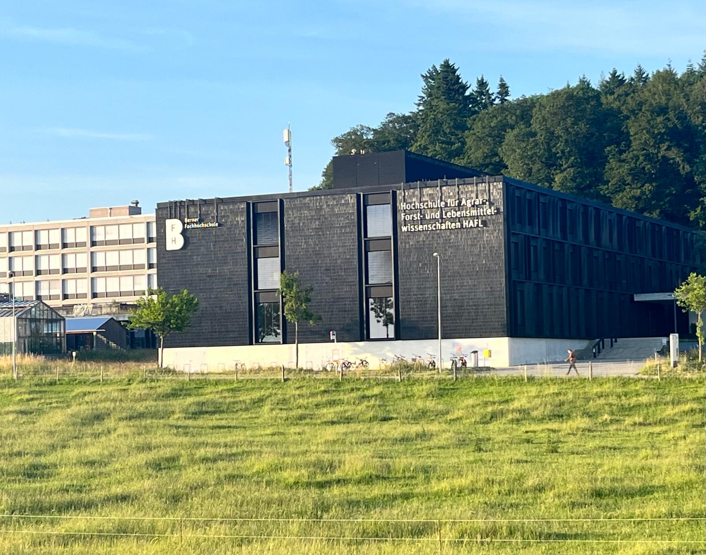
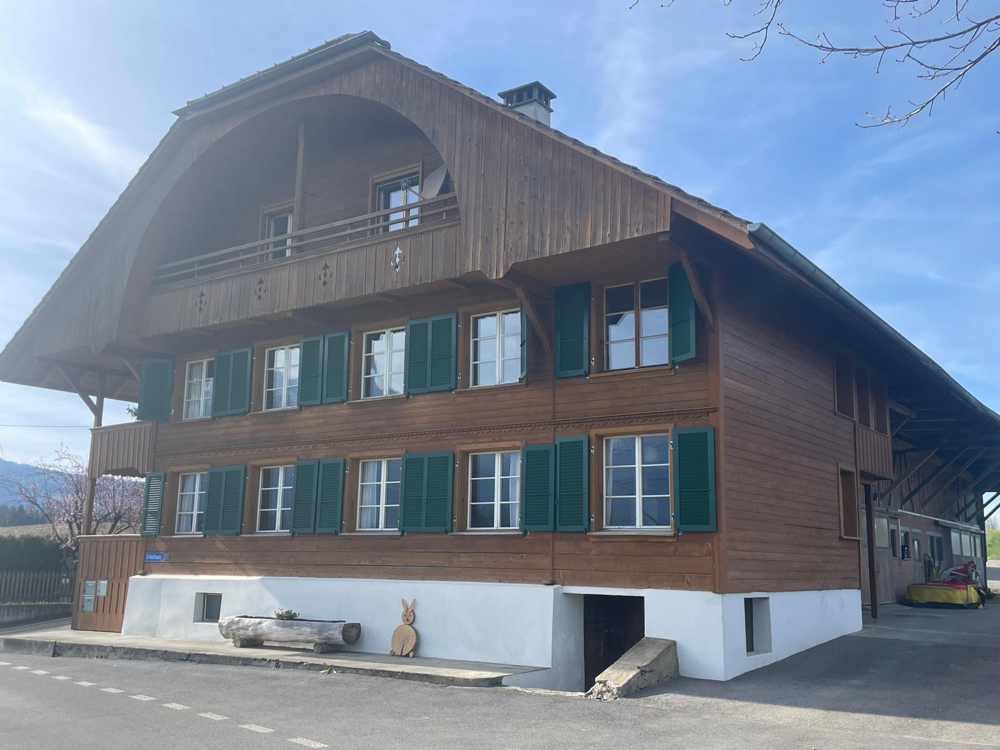
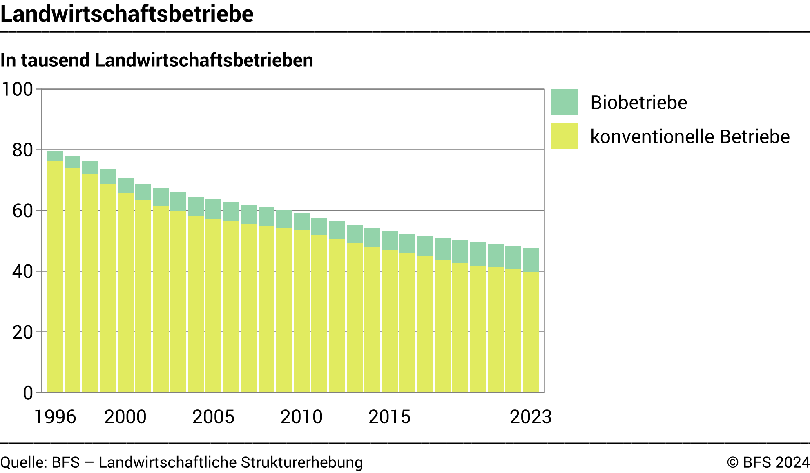
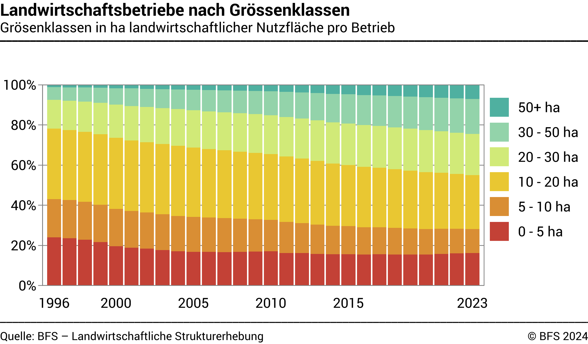

+++
title = "Land ohne Erben - Warum Berner Bauernbetriebe aussterben"
date = "2024-06-16"
draft = false
pinned = false
tags = ["Bauernbetrieb", "Reportage"]
image = "thumbnail.jpg"
description = "Eine Reportage über das Aussterben der Bauernbetriebe in der Schweiz, inklusive zwei Interviews mit Landwirtschaftlichen Personen."
footnotes = "Quelle Bilder Blogübersicht und BFH: Kilian Frei, 17.6.2024\n\nQuelle Bild Bauernbetrieb Bohny: Andrea Bohny, 28.5.2024\n\nQuelle Grafik Landwirtschaftsbetriebe: https://www.bfs.admin.ch/bfs/de/home/statistiken/land-forstwirtschaft/landwirtschaft/strukturen.assetdetail.31927955.html besucht am 16.6.2024\n\nQuelle Grafik Landwirtschaftsbetriebe nach Grössenklassen: https://www.bfs.admin.ch/bfs/de/home/statistiken/land-forstwirtschaft/landwirtschaft/strukturen.assetdetail.31927947.html besucht am 16.6.2024\n\nVielen Dank an die interviewten Personen: Andrea Bohny und Tobias Küng"
+++
<!--StartFragment-->



Täglich schliessen drei Bauernbetriebe in der Schweiz - Reportage über einen Landwirt und eine Landwirtin



### Tobias Küng

Es ist ein kühler Morgen im Berner Oberland, als die ersten Sonnenstrahlen die nebelverhangenen Wiesen von Därstetten erhellen. Tobias Küng, ein erfahrener Landwirt und wissenschaftlicher Mitarbeiter an der Berner Fachhochschule (BFH), beginnt seinen Tag auf seinem traditionellen Familienbetrieb. Küng hat vor allem Kühe, aber auch Schweine, und betreibt Ackerbau, die das Rückgrat seines Betriebs bilden. Im Sommer grasen seine Rinder auf einer weitläufigen Alp, die sich majestätisch über die Hügel von Därstetten bis hinten zum Stockhorn erstreckt.

Die Anzahl der Bauernbetriebe nimmt in der Schweiz ab, insbesondere kleine bis mittelgrosse Betriebe. Andrea Bohny und Tobias Küng haben beide im Jahr 2021 jeweils einen Bauernbetrieb übernommen. An der Berner Fachhochschule HAFL, Hochschule für Agrar-, Forst- und Lebensmittelwissenschaften, wo sie beide tätig sind, haben wir separate Interviews mit ihnen geführt, um ihre Perspektiven als Landwirte zu erfahren.



### Andrea Bohny

Eine kurze Fahrt durch die malerische Hügellandschaft führt nach Uetendorf, wo Andrea Bohny, Assistentin für nachhaltige Landwirtschaft an der BFH, ihren Bio-Betrieb leitet. Bohny, die ihren Hof durch eine ausserfamiliäre Übergabe übernommen hat, widmet sich ausschliesslich dem Ackerbau. Ihr Engagement für nachhaltige Landwirtschaft spiegelt sich in jeder einzelnen der jungen Pflanzen wider, die sie mit Sorgfalt und Hingabe pflegt. Auch Bohny steht vor den Herausforderungen, die das moderne Bauerndasein mit sich bringt.



Küng, der gerade seine 22 Rinder auf die Alp bringt, begutachtet die wunderbare Aussicht auf das Simmental. Auf der Alp angekommen, sind seine Geschäftspartner und Nachbarsbetriebe schon mit ihren Kühen angekommen. Diese rund 50 Tiere geniessen den ganzen Sommer lang eine riesige 90 Hektaren Wiese. Die Kühe dienen Küng zur Milchherstellung, und umso wenig Abfall wie möglich zu produzieren, verwendet er die Nebenprodukte als Futter für seine Schweine. Neben seinen Tieren hat Küng auch noch eine Nutzfläche von circa 30 Hektaren, auf der er Gemüse und Früchte aller Art pflanzt. Heute ist Küng vor allem als Leiter des Ganzen tätig, „mindestens einen halben Tag pro Woche arbeite ich im Büro“, erläuterte er. Arbeiter, die ihm helfen, hat er sieben. Seine zwei Eltern, einen Lehrling, einen 30%-Angestellten und drei Personen, die Vollzeit auf der Alp werken. 50 % arbeitet er an der HAFL, und zu seiner restlichen Zeit meinte er, als wir ihn an der HAFL interviewten: „Es ist eigentlich ganz einfach, wenn ich nicht an der HAFL bin, dann bin ich auf dem Hof“. Ende Juli dieses Jahres reduziert er seine Arbeit an der HAFL jedoch auf 20 %, um sich mehr um seinen Hof zu kümmern.

Nach ihrem ersten Master in Agrarwissenschaften an der ETH studiert Andrea Bohny jetzt für den Master Kreislaufinnovation und Nachhaltigkeit (CIS) an der HAFL. Neben dem Master und dem Betrieb arbeitet sie auch noch 60 % an der HAFL als Assistentin für nachhaltige Landwirtschaft. Als wir sie fragten, wie sie diese drei Sachen alle unter einen Hut bringt, meinte sie nur: „Ich habe flexible Stunden an der HAFL“ und „auf dem Hof tätig zu sein, ist auch ein Ausgleich für mich“. 16 km von ihrem Bio-Betrieb entfernt befindet sich der Betrieb ihres Vaters, mit dem sie sich ebenfalls befasst. Die beiden Betriebe dürfen offiziell jedoch nicht als Betriebsgemeinschaft bezeichnet werden, da sie die gesetzliche Voraussetzung, dass die Betriebe innerhalb einer maximalen Distanz von 15 km voneinander liegen müssen, nicht erfüllen. Ihr Vater ist jedoch noch nicht bereit, seinen Bauernbetrieb aufzugeben, deshalb musste sie einen anderen Weg finden, um an ihren zu gelangen. Doch glücklicherweise benötigten die Nachbarn der Eltern noch eine passende Nachfolgerin für ihren Bauernbetrieb, und somit erhielt Bohny im Jahr 2021 ihren eigenen Bauernbetrieb.

### Problem

Laut einer Studie des Bundesamtes für Statistik sind in den letzten zwanzig Jahren über ein Drittel der Bauernbetriebe verschwunden.



Hauptsächlich schliessen Betriebe in der Grösse von einer bis rund 20 Hektaren landwirtschaftlicher Nutzfläche, während es von Betrieben über 30 Hektaren sogar mehr gibt. Einige Betriebe fusionieren zusammen, andere werden von den grösseren aufgekauft, und leider schliessen auch einige komplett.



Für viele Landwirte im Raum Bern und auch der gesamten Schweiz wird es immer schwieriger, nur durch den Bauernbetrieb genug zu verdienen. Die Gründe sind vielfältig: zunehmende Arbeit, zu hohe Qualitätserwartungen, schlechter Boden durch den Klimawandel und wirtschaftlicher Druck. Die HAFL dient Küng und Bohny als finanzielle Absicherung im Falle eines schlechten Erntejahres. Küng erwähnte dazu, dass, falls er Vollzeit an der HAFL arbeiten würde, würde er viel mehr verdienen. 

### Betriebsübergabe

Jede Bauernfamilie steht eines Tages vor der Frage, wie sie den Betrieb an die nächste Generation übergeben soll. Da die Baby-Boomer-Generation in den Ruhestand geht, müssen sich viele Bauernfamilien in der Schweiz Gedanken über diese Übergabe machen. Laut einer Studie von Agroscope aus dem Jahr 2020 sind mehr als 50 % der Landwirte 50 Jahre alt oder älter, und laut einer Studie des Bundesamtes für Statistik im Jahr 2019 sind sogar mehr als 40 % 55 Jahre alt oder älter. Die Übertragung von Betrieben ist ein komplexer und anspruchsvoller Prozess, der sich über mehrere Jahre erstrecken kann. Küng erklärt, dass er sich zwischen 2015 und 2017 dazu entschlossen hat, den Hof seiner Eltern zu übernehmen, der ihm aber erst seit Januar 2021 offiziell gehört.

Der Prozess einer Übernahme beschränkt sich nicht nur auf die Übertragung von materiellen Gütern, sondern beinhaltet auch Fragen über die Verantwortung, die Kontrolle und das Wissen. Verschiedene Faktoren beeinflussen diesen Vorgang, wie zum Beispiel die Grösse, Art des Betriebs und die Anzahl der Kinder in der Familie. Wir haben Küng gefragt, was getan werden muss, bevor mit dem eigenen Betrieb begonnen werden kann. Auf der einen Seite ist eine landwirtschaftliche Ausbildung erforderlich, sei es eine Lehre als Landwirt*in oder ein Studium der Agrarwissenschaften an der ETH oder einer anderen Hochschule. Auf der anderen Seite muss ein Hof gefunden werden. 

### Vermittlungsstellen zum Kauf und Verkauf

```
Einen Betrieb zu verkaufen oder abzukaufen, ist äusserst kompliziert. Oftmals kennen
sich die Verkäufer und Käufer schon vorher, von Familien, Freunden oder sonstigen
Bekannten. Ausser mit Inseraten in Bauernzeitungen auf den Betrieb aufmerksam zu 
machen, was nicht grosse Wirkung hat, gibt es sonst fast keine Mittel dafür. Deshalb
gibt es spezialisierte Vermittlungsstellen wie den Schweizer Bauernverband (SBV),
welcher Beratungsdienste, Informationsveranstaltungen und Workshops zur Hofübergabe
zur Verfügung stellt. Andere Stellen wie Agrarland Schweiz oder die Landwirtschaftliche
Kreditgenossenschaft (LKG) unterstützen die Landwirte finanziell und bieten
massgeschneiderte Finanzlösungen an.
```

Aufgrund des Bundesgesetzes über das bäuerliche Bodenrecht ist es jedoch einfacher für Personen, deren Eltern bereits einen Betrieb besitzen, diesen zu übernehmen, im Vergleich zu Menschen ohne eine solche Möglichkeit. Daher erfolgen trotz zunehmender ausserfamiliärer Übergaben deutlich mehr Übernahmen innerhalb der Familie. Nachdem diese Punkte geklärt sind, stellt sich die Frage, ob der Hof finanziell leistbar ist. Es ist wichtig, mit den Banken zu sprechen, um zu prüfen, ob und wie die Finanzierung des Hofs möglich ist, einschliesslich der Klärung eventueller bestehender Schulden auf dem Hof. Sobald dies geklärt ist, muss ein Preis vereinbart werden. Küng betont auch, dass im Falle von Geschwistern zuerst mit diesen gesprochen werden sollte, um ihre Pläne zu erfahren. Falls sie kein Interesse an der Hofübernahme haben, sollten sie über den Kaufpreis informiert werden, um ein faires Verfahren sicherzustellen. Danach müssen alle zuständigen Behörden darüber informiert werden, wer der neue Verantwortliche für den Hof ist.

### Das Bundesgesetz über das bäuerliche Bodenrecht (BGBB)

```
Das Bundesgesetz über das bäuerliche Bodenrecht (BGBB) hat das Ziel, das bäuerliche
Grundeigentum zu fördern und Familienbetriebe zu erhalten. Um eine Zersplitterung des
Hofes zu vermeiden, haben Nachkommen, die den Hof weiterführen wollen, ein bevorzugtes
Erbrecht. Der übernehmende Erbe muss den nicht übernehmenden Erben ihren jeweiligen
Pflichtteil auszahlen; diese Auszahlung kann über längere Zeit gestreckt werden. Den
meisten Bauern wird empfohlen, eine frühzeitige und sorgfältige Nachfolgeplanung mit
Hilfe von Beratern zu erstellen, um Konflikte und finanzielle Probleme zu vermeiden.
```

Bohny hingegen sagt, dass es wichtig ist, nicht naiv zu sein, und dass es nicht so einfach ist, einen Hof zu übernehmen. Sie erwähnt, dass sie Glück hatte, bereits gute Grundkenntnisse für das Büro und die Buchhaltung zu haben, aber dass die administrative Arbeit keinesfalls unterschätzt werden darf. 

### Meinungsverschiedenheit

In der Schweiz findet die Übertragung von Betrieben in der Regel innerhalb der Familie statt, obwohl die ausserfamiliären Übertragungen zunehmen. Oft arbeiten die Eltern nach der Übergabe weiter auf dem Hof, wie im Fall von Küng, dessen Eltern pensioniert sind, aber immer noch auf dem Hof arbeiten. Die Art und Weise, wie der Prozess der Hofnachfolge abläuft, beeinflusst die Zukunft des Betriebs und legt die Grundlage für die Organisation des Zusammenlebens und der Zusammenarbeit nach der Übergabe. Bei Diskussionen über die Zukunft des Betriebs überwiegen wirtschaftliche und technische Erwägungen, während die Verbundenheit mit dem Hof rationale Entscheidungen verhindern kann. Manchmal wollen die Kinder von Landwirten den Familienbetrieb nicht übernehmen, was berücksichtigt werden muss, da es wichtig ist, alternative Pläne zu entwickeln, um sicherzustellen, dass der Betrieb auch in der Zukunft erfolgreich fortgeführt werden kann, unabhängig von der Entscheidung der Kinder. Bohny erzählt, dass sie Leute kennt, für die es schon als Kind klar war, dass sie den Hof ihrer Eltern übernehmen wollten, und andere, die den Hof ihrer Eltern nicht übernommen haben. Ihrer Meinung nach liegt die Ursache dafür darin, dass es heute immer schwieriger wird, einen Hof zu haben, der genügend Einkommen bringt, was die jungen Leute demotiviert. Sie würden lieber weniger arbeiten und mehr verdienen als mehr arbeiten und weniger verdienen. Als wir ihr erzählten, dass laut dem Bundesamt für Statistik jeden Tag drei Bauernhöfe verschwinden, antwortete sie nur mit:

> \
>  „Horror..., aber verständlich.“ 
>
> *Andrea Bohny*

Als Grund nannte sie den Preisdruck, der vor allem bei konventionellen Bauernhöfen enorm sei, und dass die jungen Leute in einer anderen Branche arbeiten und mehr verdienen könnten. Auf die Frage, ob sie sozialen Druck fühle, den Hof ihres Vaters zu übernehmen, antwortete Bohny, dass sie keinen spürt. Ihr Vater hat ihr immer die Wahl gelassen und ihr versichert, dass es andere gebe, die den Hof übernehmen könnten, falls sie dies nicht tun würde. Sie ist der Meinung, dass die Kommunikation mit ihrem Vater in dieser Hinsicht einfach ist. Heute ziehen es viele junge Menschen vor, den Hof ihrer Eltern nicht zu übernehmen, weil sie an einem anderen Ort bessere Möglichkeiten mit einem höheren Einkommen finden. Dies ist problematisch und führt zur Schliessung von Betrieben. Als Küng die Grafiken des Verschwindens der Bauernbetriebe vom Bundesamt für Statistik sah, erklärte er, dass es die mittleren Betriebe sind, die schliessen, weil sie nicht rentabel genug sind. Seiner Meinung nach handelt es sich bei den kleinen Betrieben oft um "Freizeit"-Betriebe, bei denen die Betreiber nicht auf das landwirtschaftliche Einkommen angewiesen sind. Er fügte hinzu, dass, während die Zahl der mittleren Betriebe sinkt, die Zahl der grossen Betriebe steigt, was das Ergebnis von Fusionen ist, wie die, die er mit seinen Nachbarn in einem Jahr vorhat.

### Blick in die Zukunft

Bohny plant in naher Zukunft keine Änderungen und möchte ihre Zeit weiterhin gleichmässig zwischen der HAFL und ihrem Betrieb aufteilen. Sobald ihr Vater jedoch nicht mehr in der Lage ist, sich um seinen Hof zu kümmern, wird sie diesen übernehmen und ihre Zeit neu organisieren müssen. Küng hingegen wird sich vollständig der Landwirtschaft widmen, indem er sich mit dem Nachbarsbetrieb zusammenschliesst und so einen grossen Betrieb schafft.

### Ein warmer Mittag im Berner Oberland:

Die Sonne hat die Wiesen vollständig erwärmt. Andrea Bohny und Tobias Küng setzen ihre Arbeit fort, entschlossen, ihre Betriebe zu erhalten und die Herausforderungen des modernen Bauerndaseins zu meistern.

*Geschrieben von Eilidh Janssens und Kilian Frei*

<!--EndFragment-->[](https://www.bfs.admin.ch/bfs/de/home/statistiken/land-forstwirtschaft/landwirtschaft/strukturen.assetdetail.31927947.html)